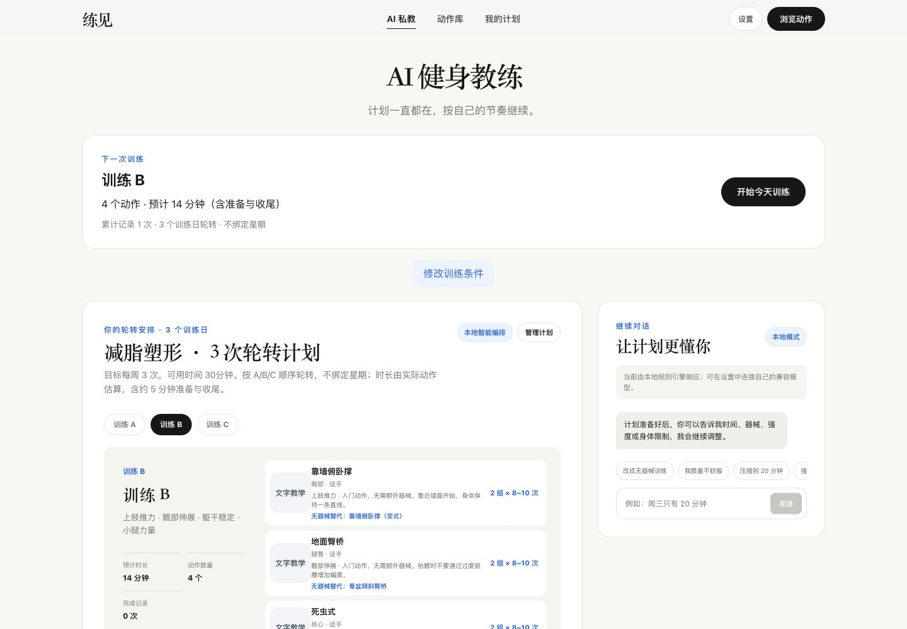
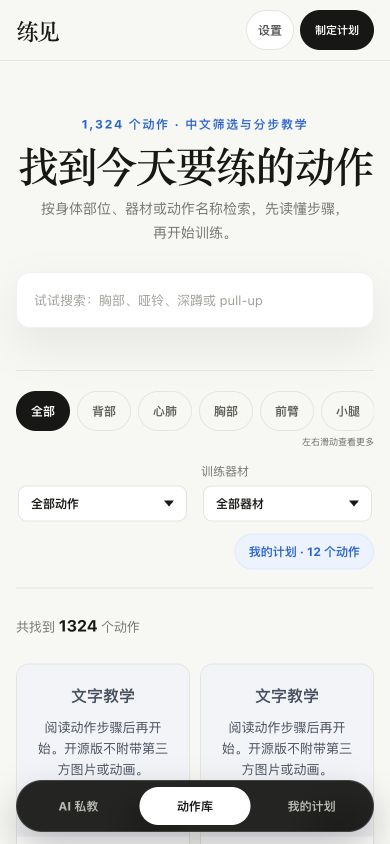

# 练见 · Lianjian

一个本地优先、支持自定义 AI 模型的开源健身计划与训练记录工具。

[English](README.en.md) · [贡献指南](CONTRIBUTING.md) · [路线图](ROADMAP.md) · [安全与隐私](SECURITY.md)

**早期 MVP**：适合探索居家、徒手与轻器械训练流程。不是专业训练认证、医疗建议或康复工具；动作标签与源数据说明尚未经过完整专业审核。

## 能做什么

- **计划**：按训练水平、器械、时间和身体限制生成 A/B/C 轮转安排；按训练日添加、替换、移动、排序和删除动作。
- **执行**：逐组完成、记录实际次数/时长和可选重量、休息计时、跳过原因、不适反馈、中断后继续。
- **反馈**：先保存训练记录，再提出下一次调整；接受后才生效，历史使用独立快照。
- **学习**：1,324 条动作文字记录，中英文搜索、部位/器材筛选、中文分步教学；自动编排仅使用 25 个带产品标签的核心动作。
- **数据**：无需登录，本浏览器自动保存，支持 JSON 备份、校验后恢复和恢复前备份。
- **模型**：无密钥时使用本地规则；可配置兼容 OpenAI Chat Completions 的模型，失败时明确提示并回退。

> 开源版默认**文字教学**，不包含、下载或外链第三方动作图片/GIF。代码开源不代表获得素材授权。见 [第三方声明](THIRD_PARTY_NOTICES.md)。

## 界面预览

以下为默认文字模式和演示训练记录，不包含第三方动作素材。



<details>
<summary>查看手机动作库</summary>



</details>

## 快速开始

需要 Node.js 24 和 npm。动作文字数据已经包含在仓库，无需克隆其他项目、配置数据库或填写模型密钥。

```bash
git clone https://github.com/jumpersun/lianjian.git
cd lianjian
npm ci
npm run dev
```

打开终端输出的本地地址。第一次使用建议：生成计划 → 查看动作步骤 → 开始训练 → 完成/跳过组次 → 保存反馈 → 接受或保留调整建议。

```bash
npm test           # Node 内置测试框架
npm run build     # 静态产物：dist/client
npm run preview   # 本地查看构建产物
```

静态托管时发布 `dist/client`；不需要服务端。部署到子路径时可用 `npm run build -- --base=/lianjian/`。本项目不附带维护者的托管项目 ID，也不会自动发布网站。

## AI 模式与隐私

默认本地规则不是大语言模型。连接模型：右上角「设置」→「自定义模型」→填写 API 地址、模型 ID 和自己的 Key →测试连接。

- 接口需兼容 `/chat/completions`，并允许浏览器跨域请求；连接测试成功不代表结构化计划请求一定成功。
- 自定义模型只能选择本地基准计划提供的动作 ID；输出经过剂量、媒体路径及结构校验。它不是全动作库自主搜索，也不会发送完整聊天历史。
- API Key 只保存在 `sessionStorage`，不进入导出的训练备份；仍可被同源脚本读取，并非安全密钥托管。
- 请求会将资料、身体限制和计划发送给你配置的提供商，并可能产生费用。只连接可信 HTTPS 服务；不要把任何密钥放在 `VITE_` 环境变量、Issue 或公开截图中。
- 可参考 `.env.example` 配置自有服务端接口。仓库不提供公共 AI 网关、登录、云同步或密钥保管服务。

## 数据与可选素材

数据来自 [hasaneyldrm/exercises-dataset](https://github.com/hasaneyldrm/exercises-dataset)，保留 MIT 声明与原作者署名。当前包只保留中英文，完整来源、固定版本与复现方法见 [数据说明](docs/DATA.md)。

如已有适用授权，可将相应媒体文件放入本地 `public/images/`、`public/videos/`，并在 `.env.local` 设置 `VITE_ENABLE_EXERCISE_MEDIA=true` 后重启。目录默认被 Git 忽略，缺失或加载失败的文件回退文字教学。发布构建会包含你放入 `public` 的文件，因此公开部署前仍需自行确认许可；不要把受限媒体提交到 Git 历史。

## 已知边界

- 数据属于当前浏览器与站点地址；换域名、端口或清理站点数据不会自动迁移。先导出，再在新地址导入。
- 身体限制是保守规则筛选，不是临床评估；出现疼痛或明显不适请停止训练并寻求专业意见。
- 年龄/身高/体重目前不直接改变本地训练处方，配置远端模型时会作为资料发送；数据由用户自愿填写并应最小化。
- 推荐池覆盖有限，计划可能短于可用时长；不会为了凑时长补入不匹配动作。部分动作仍保留英文名称。
- 本地数据长期容量、跨浏览器文件恢复、真实模型兼容性、真实移动设备与完整无障碍仍需持续验证。

## 项目结构

```text
src/components/       页面、计划管理、训练和设置界面
src/lib/planner.js    本地规则与动作匹配
src/lib/productState.js  状态、训练快照与恢复
src/lib/aiClient.js   模型调用及输出校验
src/lib/backup.js     数据导出与导入校验
public/data/         可独立使用的文字数据
tests/               定向领域测试
```

欢迎先从中文名称核验、移动端体验、数据质量和测试贡献开始。提交时不要附带真实健康资料、密钥或未经许可的媒体。

## License

应用代码：[MIT](LICENSE)，© 2026 jumpersun。第三方数据保留上游版权；图片/GIF不在本项目授权范围。详见 [THIRD_PARTY_NOTICES.md](THIRD_PARTY_NOTICES.md)。
